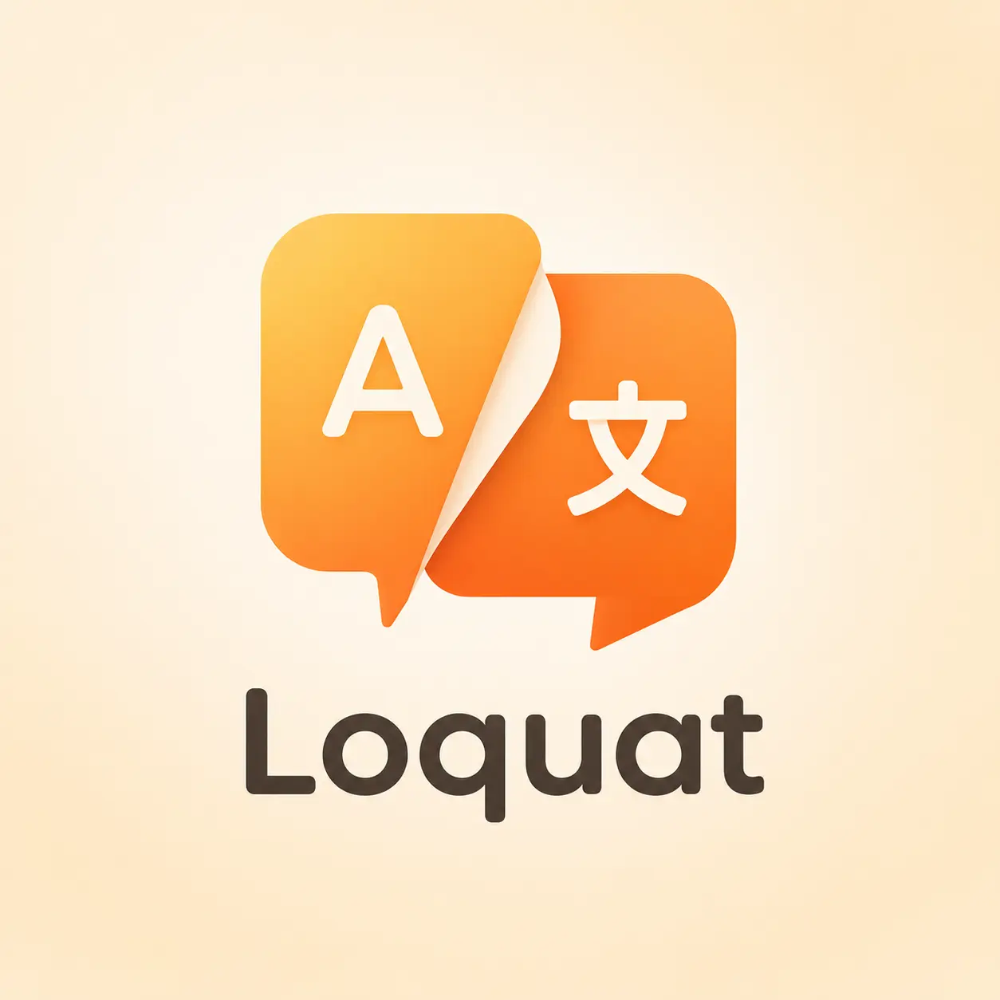
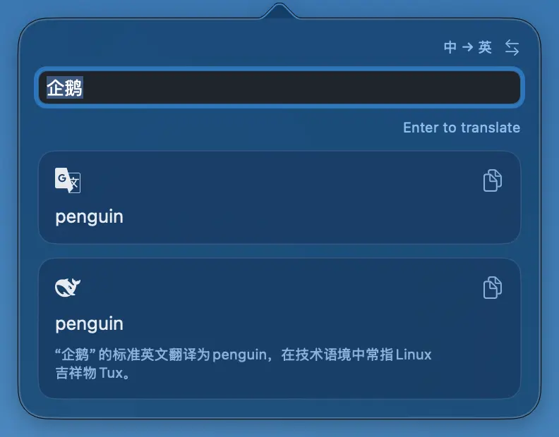
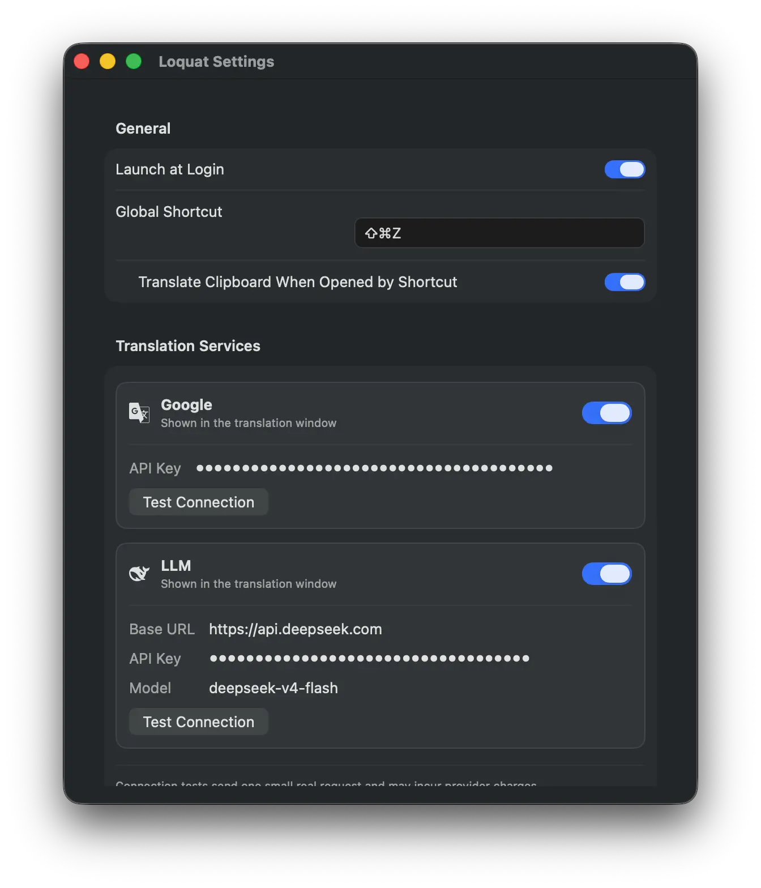

<h1 align="center">
  
  &nbsp;Loquat
</h1>

<p align="center">
  A lightweight, native macOS menu bar translator.<br/>
  Press a shortcut, translate instantly — without leaving what you're doing.
</p>

<p align="center">
  English | <a href="README_zh.md">中文</a>
</p>

<p align="center">
  
</p>

<p align="center">
  <a href="https://github.com/Moolan-d/Loquat/releases/latest"></a>
  <a href="https://github.com/Moolan-d/Loquat/releases"></a>
  
  
  <a href="LICENSE"></a>
</p>

## Features

- **Instant popover** — a global shortcut opens a warm, focused popover from the menu bar; the result appears without switching apps.
- **Two engines in parallel** — Google Translate plus any OpenAI-compatible LLM (OpenAI, DeepSeek, OpenRouter, or a self-hosted endpoint), each **translating, failing, and retrying independently**.
- **Smart direction detection** — Han-script input resolves to Chinese → English, everything else to English → Chinese; override or swap with one click.
- **Clipboard read only when you ask** — only the shortcut reads it: up to 500 characters translates immediately, longer text waits for your Enter; **menu-bar clicks never read the clipboard**.
- **Settings that cover it** — custom shortcut, Google / LLM groups each with a translation-window visibility switch, per-provider connection tests, LLM prompt presets, launch at login.
- **Keys in the Keychain only** — never in preferences, logs, or request URLs; no analytics, no telemetry; remote LLM endpoints must use HTTPS (localhost allowed for local models).

## Config Screenshots

<p align="center">
  
</p>

## Why Loquat

- **Small and native** — pure Swift, no Electron, no WebView: **~1.4 MB** to download, **~3 MB** installed, **≤ 50 MB** idle physical memory and ~0% idle CPU (verified by the release gate).
- **Spends nothing behind your back** — clipboard translation is bound to the shortcut, so unrelated copies never trigger a paid request.
- **One failure isn't total failure** — one provider's error never invalidates what the other already returned.

## Installation

1. Download `Loquat-macOS.zip` from [GitHub Releases](https://github.com/Moolan-d/Loquat/releases).
2. Unzip it and drag `Loquat.app` into `/Applications`.
3. On first launch, if Gatekeeper blocks the ad-hoc signed app, right-click → **Open**, or go to **System Settings → Privacy & Security → Open Anyway**.

## Usage

1. Click the menu-bar icon, right-click → **Settings** (or press `⌘,`).
2. Add at least one provider:
   - **Google** — paste (right-click) a Google Cloud Translation API key.
   - **LLM** — paste (right-click) an API key, Base URL, and model name (e.g. OpenAI, DeepSeek, OpenRouter).
3. Record a global shortcut.
4. (Optional) enable **Translate Clipboard When Opened by Shortcut** — it appears once a shortcut is set.
5. Press the shortcut to open the popover, then type, or let the clipboard fill it in.

### Getting a Google Cloud Translation API key

1. Go to [Google Cloud Console](https://console.cloud.google.com) and create or select a project.
2. Enable the **Cloud Translation API** (requires a billing account).
3. Open **APIs & Services → Credentials → Create credentials → API key**.
4. (Recommended) restrict the key to the Cloud Translation API.
5. Copy the key and paste (right-click) it into **Loquat → Settings → Google → API Key**.

### Shortcuts

| Action        | Shortcut                                    |
| ------------- | ------------------------------------------- |
| Open popover  | your global shortcut (set in Settings; the Delete key clears it) |
| Open Settings | right-click the menu-bar icon → Settings    |

## FAQ

### “Loquat.app” is damaged and can’t be opened

The app is ad-hoc signed and not notarized, so Gatekeeper may block it. It doesn’t mean the file is corrupted. Either right-click → **Open**, or run:

```bash
xattr -cr /Applications/Loquat.app
```

### Where are my API keys stored?

In the macOS Keychain, under `com.instanttranslation.macos.credentials`. They are never written to `UserDefaults`, logs, or request URLs.

### First-launch authorization prompts

On first launch, macOS may show two permission dialogs:

- **Keychain** — Loquat stores your API keys there. Choose **Allow** or **Always Allow** so the app can save and read them.
- **Documents access** — macOS may ask Loquat to access your files. Allow it so the app can work normally.

## Development

```bash
git clone git@github.com:Moolan-d/Loquat.git
cd Loquat

swift test                                        # run the test suite
swift run InstantTranslation                      # run from source

SIGNING_MODE=adhoc bash scripts/package-app.sh    # build a runnable build/Loquat.app
SIGNING_MODE=adhoc bash scripts/package-release.sh # build/release/Loquat-macOS.zip
```

## License

[Apache-2.0](LICENSE)
