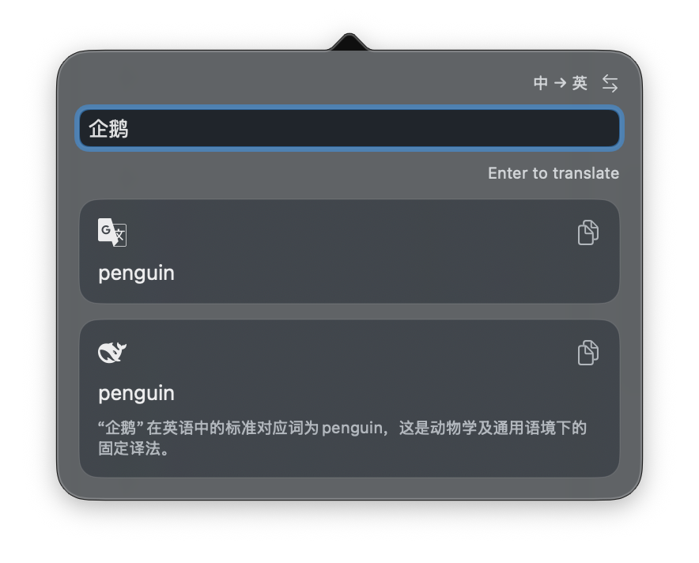

<h1 align="center">
  
  &nbsp;Loquat
</h1>

<p align="center">
  轻量的原生 macOS 菜单栏翻译工具。<br/>
  按下快捷键，即时翻译——不打断你手头的事。
</p>

<p align="center">
  <a href="README.md">English</a> | 中文
</p>

<p align="center">
  
</p>

<p align="center">
  <a href="https://github.com/Moolan-d/Loquat/releases/latest"></a>
  <a href="https://github.com/Moolan-d/Loquat/releases"></a>
  
  
  <a href="LICENSE"></a>
</p>

## 特性

- **即时弹窗** — 一个全局快捷键从菜单栏唤出热弹窗，结果即刻呈现，不用切换应用。
- **双引擎并行** — Google 翻译 + 任意 OpenAI 兼容模型（OpenAI、DeepSeek、OpenRouter 或自建端点），**独立翻译、独立成败、独立重试**。
- **智能方向检测** — 含汉字判为「中文 → 英文」，其余判为「英文 → 中文」，可一键覆盖或对调。
- **剪贴板只在你要时读取** — 仅快捷键唤出时读：≤ 500 字符立即翻译，更长的只填入输入框等你确认；**菜单栏点击永不读剪贴板**。
- **设置齐全** — 自定义快捷键、Google / LLM 分组及各自的窗口显示开关、连通性测试、LLM 提示词预设、登录时启动。
- **密钥只进钥匙串** — 绝不写入偏好设置、日志或请求 URL；无统计无遥测；远程 LLM 端点强制 HTTPS（本地模型允许 localhost）。

## 配置页截图

<p align="center">
  
</p>

## 为什么是 Loquat

- **小巧原生** — 纯 Swift，无 Electron、无 WebView：下载约 **2.2 MB**，安装后约 **4 MB**，空闲物理内存 ≤ **50 MB**、CPU 接近 0%（由发布门禁验证）。
- **不乱花钱** — 剪贴板翻译绑定在快捷键上，无关的复制不会触发付费请求。
- **不会一错全错** — 一个引擎出错，不影响另一个引擎已经拿到的结果。

## 安装

1. 从 [GitHub Releases](https://github.com/Moolan-d/Loquat/releases) 下载 `Loquat-macOS.zip`，并校验 `SHA256SUMS`（`shasum -a 256 -c SHA256SUMS`）。
2. 解压后把 `Loquat.app` 拖入 `/Applications`。
3. 先试试 Control-click（或右键）点 `Loquat.app` → **打开**。
4. 若 macOS 仍拦截，打开 **系统设置 → 隐私与安全性 → 仍要打开**。
5. 仅当上面两条 UI 路径都失败时，最后再使用 `xattr -dr com.apple.quarantine /Applications/Loquat.app`。

发布包为 ad-hoc 签名、**未经公证**。上述步骤让 Gatekeeper 放行这个特定的已下载应用；它只为该应用绕过 Gatekeeper，并不代表软件已公证。请只从 GitHub Releases 下载，并在绕过 Gatekeeper 前校验 `SHA256SUMS`。切勿全局关闭 Gatekeeper。

## 使用

1. 点击菜单栏图标，右键 → **Settings**（或按 `⌘,`）。
2. 至少配置一个引擎：
   - **Google** — 粘贴 Google Cloud Translation API 密钥。
   - **LLM** — 粘贴 API 密钥和 Base URL。其他 OpenAI 兼容端点需填写模型名；OpenRouter 可留空并使用 `openrouter/free`。
3. 录制一个全局快捷键。
4. （可选）开启 **Translate Clipboard When Opened by Shortcut**——设置快捷键后该选项才会出现。
5. 按下快捷键唤出弹窗，输入内容，或让剪贴板自动填入。

### 获取 Google Cloud Translation API 密钥

1. 打开 [Google Cloud 控制台](https://console.cloud.google.com)，新建或选择一个项目。
2. 启用 **Cloud Translation API**（需要结算账号）。
3. 进入 **API 和服务 → 凭据 → 创建凭据 → API 密钥**。
4. （推荐）把密钥限制到 Cloud Translation API。
5. 复制密钥，粘贴到 **Loquat → 设置 → Google → API Key**。

### 快捷键

| 操作     | 快捷键                                   |
| -------- | ---------------------------------------- |
| 唤出弹窗 | 你的全局快捷键（在设置中录制，Delete 键可删除）        |
| 打开设置 | 右键菜单栏图标 → Settings                |

## 常见问题

### 「Loquat.app」已损坏、无法打开

发布包为 ad-hoc 签名且未公证，macOS 可能提示异常。先尝试 **Control-click → 打开**，再到 **系统设置 → 隐私与安全性 → 仍要打开**。若两者都不行，`xattr -dr com.apple.quarantine /Applications/Loquat.app` 是最后的兜底手段——它只为这个应用绕过 Gatekeeper，不代表已公证。请只从 GitHub Releases 下载 ZIP，删除被隔离的副本并校验 `SHA256SUMS` 后再继续。

### 我的 API 密钥存在哪里？

存于 macOS 文件式钥匙串（file-based Keychain），服务名 `com.instanttranslation.macos.credentials.v3`。密钥绝不写入 `UserDefaults`、日志或请求 URL。

旧版本使用 v1/v2 钥匙串服务。Loquat 不会读取、迁移、更新或删除这些旧项，因此它们保持原有授权行为。安装后请在设置里重新输入一次各密钥；确认新项可用后，可在「钥匙串访问」中手动删除旧项。

### 钥匙串授权提示

Loquat 启动时不读取钥匙串；提示（如有）只会在打开设置或提交翻译后出现——选择「允许」或「始终允许」即可保存和读取 API 密钥。用更新的 ad-hoc 构建替换应用后，旧版 macOS 钥匙串 ACL 可能再次请求访问；这是预期行为，与 Gatekeeper 无关。此流程不需要「文稿」访问权限。

## 开发

```bash
git clone git@github.com:Moolan-d/Loquat.git
cd Loquat

swift test                                      # 运行测试套件
swift run InstantTranslation                    # 从源码运行

bash scripts/package-app.sh     # 构建 ad-hoc 签名的 build/Loquat.app
bash scripts/package-release.sh # 生成 build/release/Loquat-macOS.zip + SHA256SUMS
```

无需证书、Team ID、provisioning profile 或公证凭据。`package-release.sh` 校验校验和后会输出最终 ZIP 路径。

## 许可证

[Apache-2.0](LICENSE)
