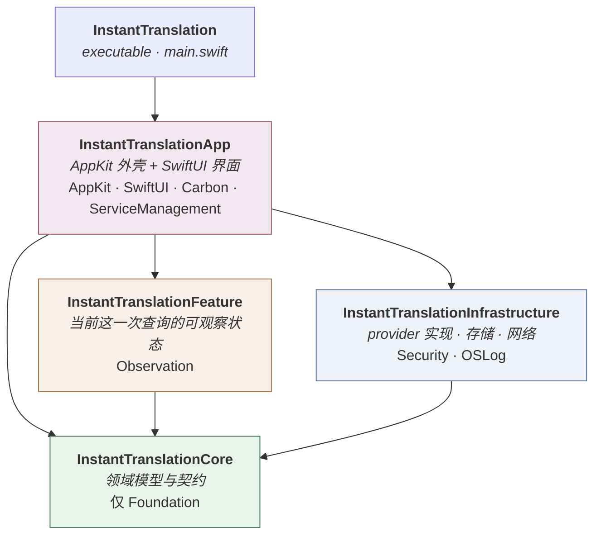
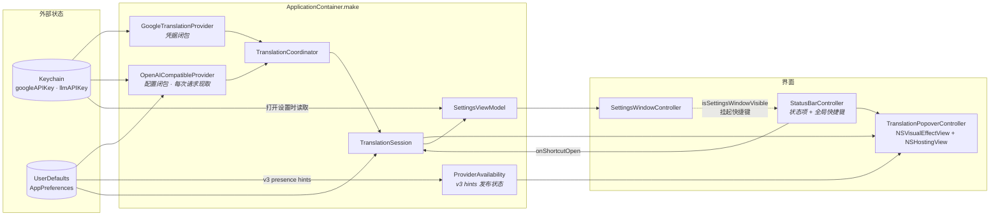

# Loquat 架构

> 对应版本 v0.3.0。本文取代 `docs/superpowers/specs/2026-08-12-instant-translation-design.md` 第 5 节中已过时的模块描述。

## 1. 模块依赖

五个 SPM target，依赖严格单向。`Core` 只依赖 Foundation，不认识网络、AppKit 和 SwiftUI，因此领域契约可以在没有任何系统框架的情况下被测试。

各层职责：

| 层 | 内容 | 不做什么 |
| --- | --- | --- |
| **Core** | `TranslationProvider` / `ContextExpansionProvider` / `InputSource` 契约，`TranslationCoordinator`，`DirectionResolver`，`LanguageCatalog`，`ClipboardTextPolicy`，`SenseExpansionPolicy` | 不发请求、不碰磁盘、不认识 UI |
| **Infrastructure** | `GoogleTranslationProvider`、`OpenAICompatibleProvider`、`HTTPTransport`、`EndpointPolicy`、`KeychainCredentialStore`、`UserDefaultsPreferencesStore`、`LLMResponseParser`、`LLMDefaultModel` | 不持有 UI 状态 |
| **Feature** | `TranslationSession`（`@Observable`）、`ProviderCardState`、`ContextExpansionState` | 不直接构造 provider，只经 coordinator |
| **App** | `ApplicationContainer`（组合根）、状态栏、弹窗、`TranslationView`、`SettingsView` | 不放业务判定 |

## 2. 组合根

`ApplicationContainer.make` 是唯一装配点。启动时只读取 UserDefaults 中非敏感的 v3 凭据状态提示；真实凭据仅在打开 Settings 或发送请求时从 Keychain 读取。

两个刻意的选择：

- **LLM 配置是闭包，不是快照。** 每次请求现读偏好与 Keychain，设置改完立即生效，不必重启或重建容器。
- **`ProviderAvailability` 是发布状态。** 启动时由 UserDefaults 中非敏感的 v3 presence hints 构造，设置保存后原位更新；窗口渲染路径不触碰 Keychain，避免启动弹窗与可感卡顿。

## 3. 一次查询的实际路径

首译两个 provider 并行、各自成败；「更多语境」是用户点击后才发出的**第二次独立请求**，只走 LLM。

```mermaid
flowchart TB
    shortcutOpen["全局快捷键唤起"] --> gate{"translateClipboardOnShortcut<br/>已开启？"}
    clickOpen["菜单栏点击唤起<br/><i>永不读剪贴板</i>"] --> input

    gate -- 否 --> input
    gate -- 是 --> read["ClipboardInputSource.read"]
    read --> policy{"ClipboardTextPolicy"}
    policy -- "≤ 500 字符" --> submit
    policy -- "> 500 字符" --> confirm["填入输入框<br/>等待手动确认"]
    confirm --> submit
    input["手动输入 · Enter"] --> submit

    submit["TranslationSession.submit"] --> resolve["DirectionResolver<br/>判定中↔英，可手动覆盖"]
    resolve --> request["TranslationRequest<br/><i>UUID · 文本 · 语向 · 提示词预设</i>"]
    request --> events["TranslationCoordinator.events<br/><i>withTaskGroup → AsyncStream</i>"]

    events --> gprov["GoogleTranslationProvider"]
    events --> lprov["OpenAICompatibleProvider"]

    gprov --> gapi["translate.googleapis.com/v2<br/><i>X-Goog-Api-Key 走 header</i>"]
    lprov --> model{"model 为空？"}
    model -- 是 --> fallback["LLMDefaultModel.resolve<br/>OpenRouter → openrouter/free<br/>其余 → unconfigured"]
    model -- 否 --> endpoint
    fallback --> endpoint["EndpointPolicy 校验<br/><i>HTTPS 或 loopback，否则不发凭据</i>"]
    endpoint --> lapi["POST {baseURL}/chat/completions<br/><i>非流式 · 60s 超时</i>"]
    lapi --> parse["LLMResponseParser<br/><i>结构化优先，退化时抢救主译文</i>"]

    gapi --> receive
    parse --> receive["session.receive(ProviderEvent)<br/><i>requestID 不符即丢弃</i>"]
    receive --> cards["ProviderCardState<br/>按完成顺序各自落卡"]

    cards --> senses{"是 LLM 结果<br/>且 SenseExpansionPolicy<br/>判定为查词？"}
    senses -- 是 --> avail["contextExpansionState = .available<br/><i>显示「More Contexts」</i>"]
    senses -- 否 --> done["结束"]
    avail --> tap["用户点击"]
    tap --> expand["coordinator.expandContext<br/><i>独立 Task · 独立生命周期</i>"]
    expand --> lprov2["仅 providers[.llm]<br/>as ContextExpansionProvider"]
    lprov2 --> expanded["补充俚语 · 网络 · 亚文化语境<br/><i>失败不影响已有译文</i>"]

    style events fill:#e8f4ea,stroke:#4a7c59
    style expand fill:#e8f4ea,stroke:#4a7c59
    style fallback fill:#fff4e0,stroke:#c89040
    style endpoint fill:#fdecec,stroke:#c05050
```

维持正确性的几条约束，改动时容易踩：

- **取消与 requestID 双重把关。** 取消负责尽快停工，`requestID` 复核拦下已越过取消点的迟到事件。少一层，上一轮的结果就会贴到新一轮的卡片上。
- **补充语境不与首译共用任务组。** 它是独立请求，失败只影响自己那一块。
- **兜底模型不落盘。** `LLMDefaultModel` 在请求路径上解析；写进偏好的话，路由名失效后会留下一个用户从未输入过的死模型名。
- **凭据先过 `EndpointPolicy`。** 非 HTTPS 且非 loopback 的 base URL 直接拒发，凭据不出机器。
