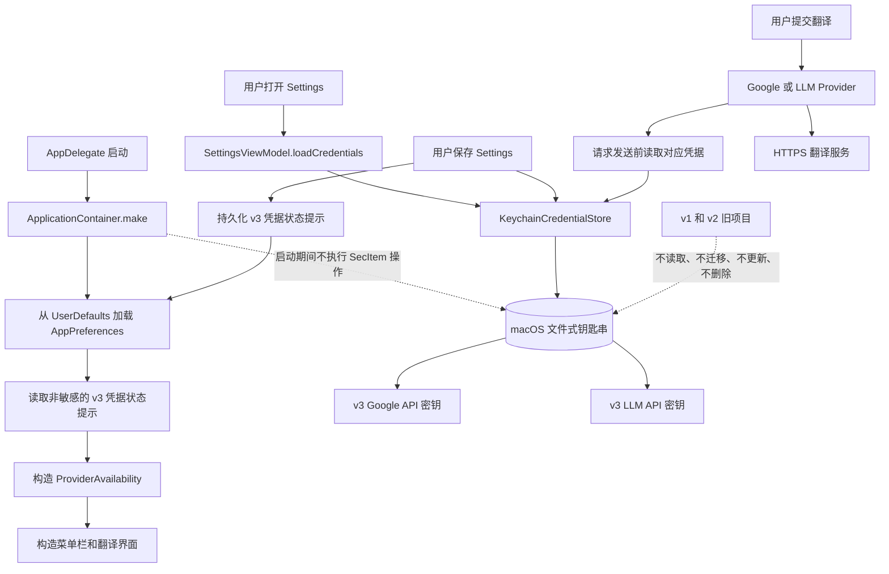
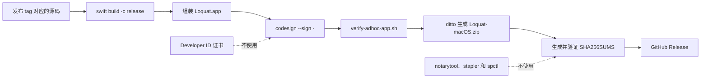

# 运行时钥匙串架构

本文档描述 Loquat v0.3.0 及后续版本采用的凭据存储与发布架构。

## 运行时架构



## 存储边界

| 数据 | 存储位置 | 访问时机 |
| --- | --- | --- |
| Google API 密钥 | macOS 文件式钥匙串 | 展示 Settings、保存 Settings 或发送 Google 请求时 |
| LLM API 密钥 | macOS 文件式钥匙串 | 展示 Settings、保存 Settings 或发送 LLM 请求时 |
| 凭据状态提示 | `UserDefaults` | 启动和保存 Settings 时 |
| Base URL、模型、提示词、快捷键、Provider 开关 | `UserDefaults` | 启动、Settings 或请求需要时 |

生产环境唯一的凭据适配器是 `KeychainCredentialStore`。它使用通用密码项目，查询条件包括：

- 服务名 `com.instanttranslation.macos.credentials.v3`；
- 账户名 `google-api-key` 或 `llm-api-key`；
- 不包含 `kSecUseDataProtectionKeychain`、`kSecAttrAccessGroup` 或显式 `kSecAttrAccessible` 属性。

凭据状态提示序列化为 `googleCredentialV3Configured` 和 `llmCredentialV3Configured`。它们只用于界面状态展示，不参与请求授权。翻译 Provider 在发送请求前始终读取真实的钥匙串项目。

## 为什么启动时没有钥匙串弹窗

应用启动期间不会执行 `SecItemCopyMatching`、`SecItemUpdate`、`SecItemAdd` 或 `SecItemDelete`。启动流程只读取非敏感偏好，并使用两个 v3 凭据状态提示构造 `ProviderAvailability`。

应用组合阶段只把凭据读取逻辑保存为闭包，不会立即执行。只有对应 Provider 实际处理翻译请求时，闭包才会读取密钥。

`SettingsViewModel` 构造时的密钥字段为空，凭据状态为 `.notLoaded`。只有用户主动打开 Settings 后，`SettingsWindowController` 才调用 `loadCredentials()`。

因此启动路径为：

```text
进程启动 -> 只读取偏好 -> 不执行钥匙串操作 -> 不触发应用侧钥匙串弹窗
```

## 为什么首次使用 v3 也可能没有弹窗

v3 服务是一个全新的命名空间。Loquat 不会访问 v1 或 v2 项目。

首次打开 Settings 时，如果 v3 项目尚不存在，`SecItemCopyMatching` 会返回 `errSecItemNotFound`。此时没有需要批准访问控制的既有受保护项目，因此通常不会弹窗。

用户首次保存凭据时，存储层执行以下流程：

```text
SecItemUpdate -> errSecItemNotFound -> SecItemAdd
```

新项目由当前应用创建，当前应用会成为它的初始授权主体。同一个构建再次读取该项目时，通常不需要额外的 ACL 授权。

因此，没有弹窗并不代表密钥绕过了钥匙串。它表示启动阶段没有访问钥匙串，并且当前构建创建了自己的 v3 项目，没有触碰旧版本留下的受保护项目。

## 哪些情况下可能再次弹窗

以下情况仍可能触发钥匙串授权弹窗：

- 使用新的 ad-hoc 构建替换当前应用，并读取已经存在的 v3 项目；
- 新构建的代码要求或 CodeDirectory 哈希发生变化；
- 项目来自备份恢复、另一台 Mac，或由其他应用创建；
- 用户在「钥匙串访问」中修改了项目的访问控制；
- 登录钥匙串被锁定或系统策略发生变化。

ad-hoc 签名无法在所有后续构建之间提供稳定的 Developer ID 身份。当前架构能够保证应用启动时不执行任何钥匙串操作，但不能保证 macOS 在应用更新后永远不请求 ACL 授权。

Gatekeeper 授权是另一套独立机制。它发生在进程启动之前，与钥匙串项目访问无关。

## 发布架构



发布产物使用 ad-hoc 签名，并且未经 Apple 公证。发布验证会确认：

- `codesign --verify --deep --strict` 执行成功；
- 签名详情包含 `Signature=adhoc`；
- 签名详情包含 `TeamIdentifier=not set`；
- ZIP 以 `Loquat.app/` 开头；
- ZIP 不包含 `._` 或 `__MACOSX` 项目；
- `shasum -a 256 -c SHA256SUMS` 校验成功。

## 相关实现

- `Sources/InstantTranslationApp/Application/ApplicationContainer.swift`
- `Sources/InstantTranslationApp/Settings/SettingsViewModel.swift`
- `Sources/InstantTranslationApp/Settings/SettingsWindowController.swift`
- `Sources/InstantTranslationInfrastructure/Storage/CredentialStore.swift`
- `Sources/InstantTranslationInfrastructure/Storage/PreferencesStore.swift`
- `scripts/package-app.sh`
- `scripts/package-release.sh`
- `scripts/verify-adhoc-app.sh`
